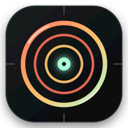
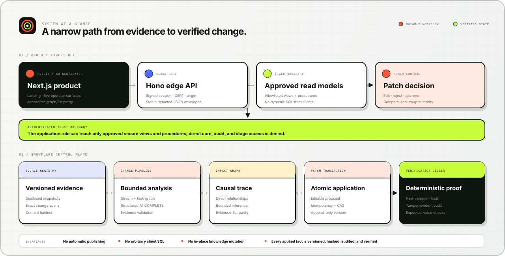

<p align="center">
  
</p>

<p align="center">
  
</p>

<h1 align="center">Ripple</h1>

<p align="center">
  <strong>Change intelligence for living knowledge systems.</strong><br />
  Trace authoritative changes, understand every downstream consequence, and apply human-controlled repairs with deterministic proof.
</p>

<p align="center">
  
  
  
  
  
  
  
  
</p>

<p align="center">
  <a href="#the-platform">Platform</a> ·
  <a href="#how-ripple-works">Workflow</a> ·
  <a href="#system-at-a-glance">Architecture</a> ·
  <a href="#trust-by-construction">Trust</a> ·
  <a href="#development">Development</a>
</p>

---

## The platform

Business-critical knowledge rarely fails all at once. A source changes first: a runtime version, API route, operating limit, policy clause, or required procedure. The consequences then spread quietly through runbooks, support guidance, workflows, policies, and automation.

**Ripple makes that propagation visible and controllable.**

It maintains versioned source evidence, identifies material factual changes, maps their downstream impact, and prepares bounded repair proposals for a human decision. An approved repair is never an in-place overwrite: Ripple creates a new asset version, records the decision, computes its hash, and verifies the expected fact deterministically.

| When the world changes                         | Ripple responds with                                                     |
| ---------------------------------------------- | ------------------------------------------------------------------------ |
| An authoritative source publishes a new fact   | Versioned content, exact evidence spans, and a reproducible content hash |
| Teams cannot see which knowledge is now unsafe | A bounded causal graph with an equivalent accessible evidence list       |
| A repair could introduce unrelated edits       | An editable, evidence-backed proposal that preserves unrelated content   |
| Two operators act on the same stale state      | Compare-and-swap enforcement and idempotent decision handling            |
| A correction appears successful but is wrong   | Deterministic expected-value checks and tamper-evident audit history     |

## How Ripple works

<p align="center">
  
</p>

1. **Capture:** Store the authoritative source version, content hash, and exact evidence spans.
2. **Validate:** Separate material factual change from noise using bounded structured analysis and deterministic evidence checks.
3. **Trace:** Map direct and inferred downstream relationships without allowing an unbounded graph.
4. **Decide:** Give an operator the source change, current asset span, editable replacement, evidence chain, and explicit consequences.
5. **Verify:** Apply atomically, create an append-only version, and record deterministic verification plus audit proof.

## System at a glance

<p align="center">
  
</p>

The browser never receives arbitrary database authority. A small Hono Worker exposes stable redacted envelopes and fixed operations. Its Snowflake application role can reach approved secure views and procedures only; direct access to core tables, audit tables, and raw stages is denied.

Inside Snowflake, one authoritative Stream/task graph drives bounded analysis. Patch application is an atomic compare-and-swap transaction, while verification and the audit chain remain deterministic.

## Trust by construction

Ripple treats safety as a product behavior, not a disclaimer.

- **Human authority stays final.** Ripple can prepare a repair; it cannot silently publish one.
- **Every claim carries evidence.** Source version, exact span, relationship, and expected value remain inspectable.
- **Every applied fact is append-only.** Historical asset versions are preserved rather than overwritten.
- **Every mutation is concurrency-safe.** Row versions, patch revisions, idempotency keys, and atomic checks reject stale or conflicting decisions.
- **Every repair proves its result.** Verification checks the expected value and records the outcome in a tamper-evident audit history.
- **Every boundary is narrow.** Strict input schemas, signed sessions, CSRF/origin enforcement, fixed SQL, redacted errors, and least-privilege Snowflake access reduce ambient authority.

Read the complete [security model](docs/SECURITY.md), [architecture decision record](docs/ARCHITECTURE.md), and [rollback runbook](docs/ROLLBACK_RUNBOOK.md).

## Product surfaces

Ripple organizes the operator journey into five focused workspaces:

| Surface                  | Purpose                                                                                             |
| ------------------------ | --------------------------------------------------------------------------------------------------- |
| **Command Center**       | Baseline health, recent material changes, affected assets, and decisions requiring attention        |
| **Change Event**         | Old/new source diff, evidence spans, bounded change atoms, and persisted pipeline progress          |
| **Impact View**          | Small causal graph synchronized with a complete accessible evidence list                            |
| **Patch Review**         | Current knowledge, proposed replacement, editable content, evidence, and apply/reject consequences  |
| **Verification & Proof** | New version ID and hash, deterministic checks, task history, audit event, and bounded cost evidence |

Source registry and operational controls remain supporting panels rather than competing primary screens.

## Repository map

```text
apps/
  web/                 Next.js product experience
  edge-api/            Hono Cloudflare Worker boundary
snowflake/
  migrations/          Forward and paired rollback SQL
  procedures/          JavaScript and Python procedure sources
  tests/               Deterministic pipeline and transaction tests
packages/
  contracts/           Shared API and domain contracts
scripts/               Provisioning, preflight, migration, and operations tooling
docs/                  Architecture, security, ledgers, evidence, and runbooks
design/visual-lock/    Owner-review visual direction artifacts
```

## Development

### Prerequisites

- Node.js `24.14.0`
- pnpm `11.7.0`
- Python `3.11.x`
- `uv`
- Snowflake CLI for live platform operations

### Install and validate

```bash
corepack enable
pnpm install --frozen-lockfile
uv sync --frozen

pnpm lint
pnpm typecheck
pnpm test
pnpm build
uv run ruff check .
uv run mypy
uv run pytest
```

The edge runtime uses [`apps/edge-api/.dev.vars.example`](apps/edge-api/.dev.vars.example) as its non-secret configuration contract. Never commit `.dev.vars`, Snowflake private keys, access codes, session keys, or account identifiers.

Snowflake provisioning, migration, rollback, and teardown are intentionally documented as controlled operations rather than compressed into a single unsafe command. Begin with the [preflight report](docs/PREFLIGHT_REPORT.md), [architecture guide](docs/ARCHITECTURE.md), and [rollback runbook](docs/ROLLBACK_RUNBOOK.md).

## Delivery status

The Snowflake foundation, authoritative task graph, structured analysis, evidence validation, bounded retries, atomic patch transaction, deterministic verification, and authenticated edge boundary have passed their local and live acceptance gates. The production visual system and public Cloudflare release are the active delivery stages.

The binding engineering specification is [`RIPPLE_IMPLEMENTATION_BLUEPRINT_CORRECTED.md`](RIPPLE_IMPLEMENTATION_BLUEPRINT_CORRECTED.md). Contributor rules are in [`AGENTS.md`](AGENTS.md), and evidence for every meaningful slice is recorded in [`docs/BUILD_LOG.md`](docs/BUILD_LOG.md).
